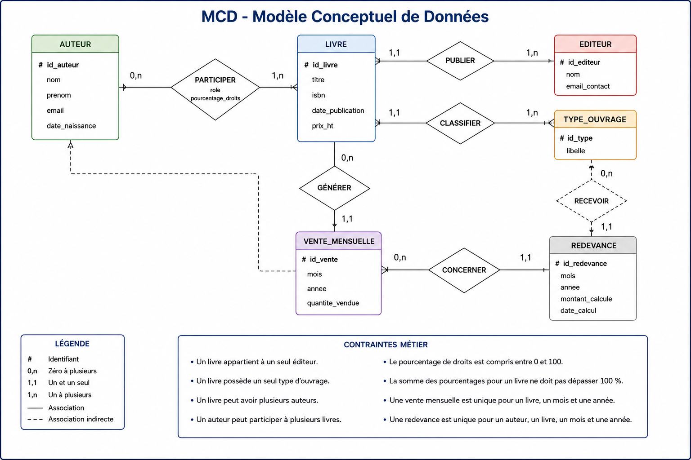
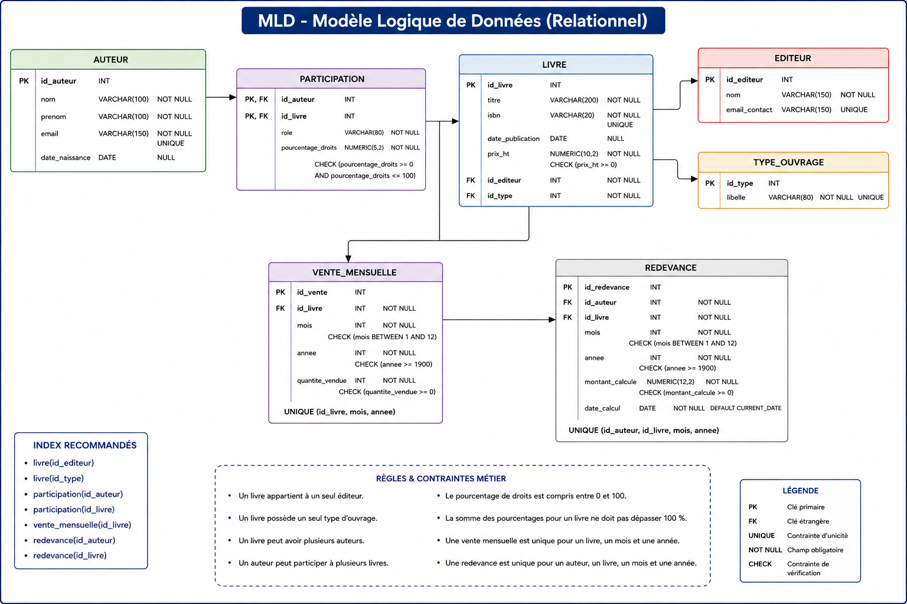

# Phase 1 — Analyse conceptuelle

Entités principales

Auteur

id_auteur
nom
prenom
email
date_naissance

Editeur

id_editeur
nom
email_contact

TypeOuvrage

id_type
libelle
Exemples : roman, essai, bande dessinée, manuel, livre audio.

Livre

id_livre
titre
isbn
date_publication
prix_ht
id_editeur
id_type

Participation

id_auteur
id_livre
role
pourcentage_droits

Cette entité associative permet de gérer les cas où plusieurs auteurs participent à un même livre.

VenteMensuelle

id_vente
id_livre
mois
annee
quantite_vendue

Redevance

id_redevance
id_auteur
id_livre
mois
annee
montant_calcule
date_calcul

# Cardinalités du MCD

EDITEUR 1,n —— publier —— 1,1 LIVRE
TYPE_OUVRAGE 1,n —— classifier —— 1,1 LIVRE
AUTEUR 0,n —— PARTICIPATION —— 1,n LIVRE
LIVRE 0,n —— générer —— 1,1 VENTE_MENSUELLE
AUTEUR 0,n —— recevoir —— 1,1 REDEVANCE
LIVRE 0,n —— concerner —— 1,1 REDEVANCE

# Contraintes métier

Un livre appartient à un seul éditeur.
Un livre possède un seul type d’ouvrage.
Un livre peut avoir plusieurs auteurs.
Un auteur peut participer à plusieurs livres.
Le pourcentage de droits doit être compris entre 0 et 100.
La somme des pourcentages pour un livre ne devrait pas dépasser 100 %.
Une vente mensuelle est unique pour un livre, un mois et une année.
Une redevance est unique pour un auteur, un livre, un mois et une année.

# Phase 2 — MLD

AUTEUR(
id_auteur PK,
nom,
prenom,
email,
date_naissance
)

EDITEUR(
id_editeur PK,
nom,
email_contact
)

TYPE_OUVRAGE(
id_type PK,
libelle
)

LIVRE(
id_livre PK,
titre,
isbn,
date_publication,
prix_ht,
id_editeur FK → EDITEUR(id_editeur),
id_type FK → TYPE_OUVRAGE(id_type)
)

PARTICIPATION(
id_auteur FK → AUTEUR(id_auteur),
id_livre FK → LIVRE(id_livre),
role,
pourcentage_droits,
PK(id_auteur, id_livre)
)

VENTE_MENSUELLE(
id_vente PK,
id_livre FK → LIVRE(id_livre),
mois,
annee,
quantite_vendue
)

REDEVANCE(
id_redevance PK,
id_auteur FK → AUTEUR(id_auteur),
id_livre FK → LIVRE(id_livre),
mois,
annee,
montant_calcule,
date_calcul
)

# Phase 3 — Script SQL

CREATE TABLE auteur (
id_auteur SERIAL PRIMARY KEY,
nom VARCHAR(100) NOT NULL,
prenom VARCHAR(100) NOT NULL,
email VARCHAR(150) UNIQUE NOT NULL,
date_naissance DATE
);

CREATE TABLE editeur (
id_editeur SERIAL PRIMARY KEY,
nom VARCHAR(150) NOT NULL,
email_contact VARCHAR(150) UNIQUE
);

CREATE TABLE type_ouvrage (
id_type SERIAL PRIMARY KEY,
libelle VARCHAR(80) UNIQUE NOT NULL
);

CREATE TABLE livre (
id_livre SERIAL PRIMARY KEY,
titre VARCHAR(200) NOT NULL,
isbn VARCHAR(20) UNIQUE NOT NULL,
date_publication DATE,
prix_ht NUMERIC(10,2) NOT NULL CHECK (prix_ht >= 0),
id_editeur INT NOT NULL,
id_type INT NOT NULL,

    CONSTRAINT fk_livre_editeur
        FOREIGN KEY (id_editeur)
        REFERENCES editeur(id_editeur),

    CONSTRAINT fk_livre_type
        FOREIGN KEY (id_type)
        REFERENCES type_ouvrage(id_type)

);

CREATE TABLE participation (
id_auteur INT NOT NULL,
id_livre INT NOT NULL,
role VARCHAR(80) NOT NULL,
pourcentage_droits NUMERIC(5,2) NOT NULL
CHECK (pourcentage_droits >= 0 AND pourcentage_droits <= 100),

    PRIMARY KEY (id_auteur, id_livre),

    CONSTRAINT fk_participation_auteur
        FOREIGN KEY (id_auteur)
        REFERENCES auteur(id_auteur)
        ON DELETE CASCADE,

    CONSTRAINT fk_participation_livre
        FOREIGN KEY (id_livre)
        REFERENCES livre(id_livre)
        ON DELETE CASCADE

);

CREATE TABLE vente_mensuelle (
id_vente SERIAL PRIMARY KEY,
id_livre INT NOT NULL,
mois INT NOT NULL CHECK (mois BETWEEN 1 AND 12),
annee INT NOT NULL CHECK (annee >= 1900),
quantite_vendue INT NOT NULL CHECK (quantite_vendue >= 0),

    CONSTRAINT fk_vente_livre
        FOREIGN KEY (id_livre)
        REFERENCES livre(id_livre)
        ON DELETE CASCADE,

    CONSTRAINT uq_vente_livre_periode
        UNIQUE (id_livre, mois, annee)

);

CREATE TABLE redevance (
id_redevance SERIAL PRIMARY KEY,
id_auteur INT NOT NULL,
id_livre INT NOT NULL,
mois INT NOT NULL CHECK (mois BETWEEN 1 AND 12),
annee INT NOT NULL CHECK (annee >= 1900),
montant_calcule NUMERIC(12,2) NOT NULL CHECK (montant_calcule >= 0),
date_calcul DATE NOT NULL DEFAULT CURRENT_DATE,

    CONSTRAINT fk_redevance_auteur
        FOREIGN KEY (id_auteur)
        REFERENCES auteur(id_auteur),

    CONSTRAINT fk_redevance_livre
        FOREIGN KEY (id_livre)
        REFERENCES livre(id_livre),

    CONSTRAINT uq_redevance_auteur_livre_periode
        UNIQUE (id_auteur, id_livre, mois, annee)

);
Index recommandés
CREATE INDEX idx_livre_editeur ON livre(id_editeur);
CREATE INDEX idx_livre_type ON livre(id_type);
CREATE INDEX idx_participation_auteur ON participation(id_auteur);
CREATE INDEX idx_participation_livre ON participation(id_livre);
CREATE INDEX idx_vente_livre ON vente_mensuelle(id_livre);
CREATE INDEX idx_redevance_auteur ON redevance(id_auteur);
CREATE INDEX idx_redevance_livre ON redevance(id_livre);
Données d’exemple
INSERT INTO auteur (nom, prenom, email, date_naissance) VALUES
('Martin', 'Claire', 'claire.martin@example.com', '1980-04-12'),
('Durand', 'Paul', 'paul.durand@example.com', '1975-09-23'),
('Lemoine', 'Sophie', 'sophie.lemoine@example.com', '1990-01-30');

INSERT INTO editeur (nom, email_contact) VALUES
('Editions Lumière', 'contact@lumiere.fr'),
('Graphik Books', 'contact@graphikbooks.fr');

INSERT INTO type_ouvrage (libelle) VALUES
('Roman'),
('Essai'),
('Bande dessinée');

INSERT INTO livre (titre, isbn, date_publication, prix_ht, id_editeur, id_type) VALUES
('Les Ombres du Nord', '978-1111111111', '2024-03-15', 20.00, 1, 1),
('Comprendre le monde éditorial', '978-2222222222', '2023-09-10', 28.00, 1, 2),
('Ligne Claire', '978-3333333333', '2025-01-20', 16.50, 2, 3);

INSERT INTO participation (id_auteur, id_livre, role, pourcentage_droits) VALUES
(1, 1, 'Auteur principal', 100.00),
(2, 2, 'Auteur principal', 70.00),
(3, 2, 'Co-auteur', 30.00),
(3, 3, 'Scénariste', 60.00),
(2, 3, 'Illustrateur', 40.00);

INSERT INTO vente_mensuelle (id_livre, mois, annee, quantite_vendue) VALUES
(1, 4, 2026, 120),
(2, 4, 2026, 80),
(3, 4, 2026, 200);

INSERT INTO redevance (id_auteur, id_livre, mois, annee, montant_calcule) VALUES
(1, 1, 4, 2026, 2400.00),
(2, 2, 4, 2026, 1568.00),
(3, 2, 4, 2026, 672.00);
Exemple de calcul des redevances

Hypothèse simple :

redevance = prix_ht × quantité_vendue × pourcentage_droits / 100

Requête possible :

SELECT
a.nom,
a.prenom,
l.titre,
v.mois,
v.annee,
ROUND(l.prix_ht _ v.quantite_vendue _ p.pourcentage_droits / 100, 2) AS montant_redevance
FROM participation p
JOIN auteur a ON a.id_auteur = p.id_auteur
JOIN livre l ON l.id_livre = p.id_livre
JOIN vente_mensuelle v ON v.id_livre = l.id_livre;
Choix de modélisation

Le modèle utilise une table participation pour gérer les livres écrits par plusieurs auteurs. Cela permet d’attribuer un rôle et un pourcentage de droits différent à chaque auteur.

La table type_ouvrage rend le système évolutif : il sera possible d’ajouter plus tard des livres audio, ebooks, revues ou manuels sans modifier la structure principale.

Les ventes sont isolées dans vente_mensuelle, ce qui facilite les traitements comptables mensuels.

Les redevances sont stockées dans une table dédiée afin de conserver l’historique des montants calculés, même si le prix du livre ou les règles de calcul évoluent ensuite.
